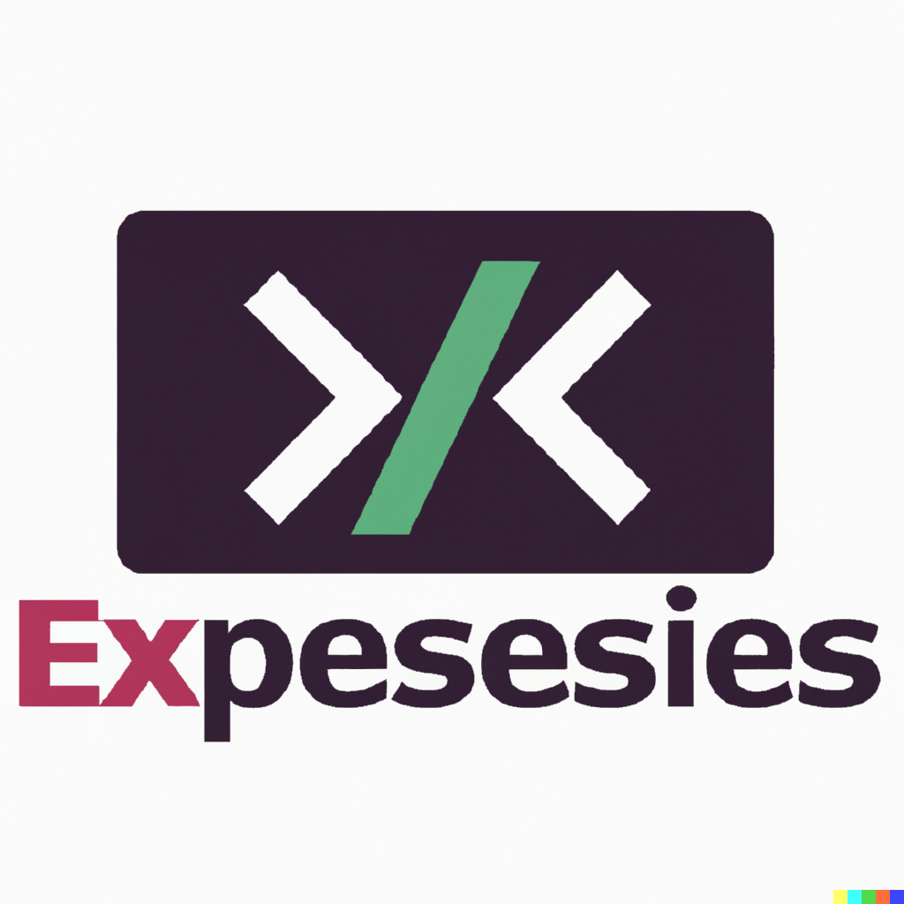

<a name="readme-top"></a>


<!-- PROJECT LOGO -->
<br />
<div align="center">
  <a href="https://github.com/vijeth-simha/nodejs-express-webapp-template">
    
  </a>

  <h3 align="center">NodeJS-Express-WebApp-Template</h3>

  <p align="center">
    The purpose of the project is as a starting point or template for building web applications using Node.js and Express. !
    <br />
    <br />
    <a href="https://github.com/vijeth-simha/nodejs-express-webapp-template/issues">Report Bug</a>
  </p>
</div>


<!-- TABLE OF CONTENTS -->
<details>
  <summary>Table of Contents</summary>
  <ol>
    <li>
      <a href="#about-the-project">About The Project</a>
      <ul>
        <li><a href="#built-with">Built With</a></li>
        <li><a href="#features">Features</a></li>
      </ul>
    </li>
    <li><a href="#Prerequisites">Prerequisites</a></li>
    <li>
      <a href="#getting-started">Getting Started</a>
<!--       <ul>
        <li><a href="#installation">Installation</a></li>
      </ul> -->
    </li>
    <li><a href="#roadmap">Roadmap</a></li>
    <li><a href="#contributing">Contributing</a></li>
    <li><a href="#contact">Contact</a></li>
  </ol>
</details>


# About The Project

This project provides a comprehensive framework for developing and launching web applications efficiently. It offers a solid foundation and structure for creating robust and interactive websites. It empowers teams to quickly set up the core components of a website and seamlessly integrate additional functionality as needed. By leveraging this project, developers can save time and effort, enabling them to deliver high-quality web applications more rapidly.


### Built With

* [![NodeJS][NodeJS.com]][NodeJS-url]
* [![JavaScript][JavaScript.com]][JavaScript-url]
* [![TypeScript][TypeScript.com]][TypeScript-url]
* [![MySQL][MySQL.com]][MySQL-url]
* [![Bootstrap][Bootstrap.com]][Bootstrap-url]

<p align="right">(<a href="#readme-top">back to top</a>)</p>


## Features

- Express server with routing and middleware support.
- Basic user authentication with session management.
- Template engine for rendering dynamic web pages.
- Static file serving for CSS, JavaScript, and images.
- API endpoints for data retrieval and manipulation.
- Database integration for persistent data storage.

<p align="right">(<a href="#readme-top">back to top</a>)</p>

### Prerequisites

Install [Node.js](https://nodejs.org/en/) version 14 and above.
* npm
  ```sh
  npm install npm@latest -g
  ```

  <p align="right">(<a href="#readme-top">back to top</a>)</p>
<!-- GETTING STARTED -->
## Getting Started

1. Clone the repository
```
git clone  https://github.com/vijeth-simha/nodejs-express-webapp-template.git
```
2. Install dependencies
```
cd web-app
npm install
```
3. Configure database credentials in db.ts
```
export const AppDataSource = new DataSource({
  type: "mysql",
  host: <<YOUR_HOST>>,
  port: <<YOUR_PORT>>,
  username: <<YOUR_USERNAME>>,
  password: <<YOUR_PASSWORD>>,
  database: <<YOUR_DATABASENAME>>,
  synchronize: true,
  logging: false,
  entities: [User,Course,Contact,About,Image],
});
```
4. Run the project
```
npm start
```
  Navigate to `http://127.0.0.1:5000/`

5. Build the project 

```
npm run build
```
  You can find the compiled files in dist folder.


<p align="right">(<a href="#readme-top">back to top</a>)</p>


<!-- ROADMAP -->
## Roadmap

- [ ] Add Additional Templates w/ Examples
- [ ] Refactoring some parts of the code
- [ ] Add test cases
- [ ] Add additional pages for further development

See the [open issues](https://github.com/vijeth-simha/nodejs-express-webapp-template/issues) for a full list of proposed features (and known issues).

<p align="right">(<a href="#readme-top">back to top</a>)</p>


<!-- CONTRIBUTING -->
## Contributing

Contributions are what make the open source community such an amazing place to learn, inspire, and create. Any contributions you make are **greatly appreciated**.

If you have a suggestion that would make this better, please fork the repo and create a pull request. You can also simply open an issue with the tag "enhancement".
Don't forget to give the project a star! Thanks again!

1. Fork the Project
2. Create your Feature Branch (`git checkout -b feature`)
3. Commit your Changes (`git commit -m 'Add some AmazingFeature'`)
4. Push to the Branch (`git push origin feature`)
5. Open a Pull Request

<p align="right">(<a href="#readme-top">back to top</a>)</p>


<!-- CONTACT -->
## Contact

Vieth Simha - [@vijeth_simha](https://twitter.com/vijeth_simha) - vijethsimha71@gmail.com

Project Link: [https://github.com/vijeth-simha/nodejs-express-webapp-template](https://github.com/vijeth-simha/nodejs-express-webapp-template)

<p align="right">(<a href="#readme-top">back to top</a>)</p>


[JavaScript.com]: https://img.shields.io/badge/javascript-%23323330.svg?style=for-the-badge&logo=javascript&logoColor=%23F7DF1E
[JavaScript-url]: https://developer.mozilla.org/en-US/docs/Web/JavaScript
[Bootstrap.com]: https://img.shields.io/badge/Bootstrap-563D7C?style=for-the-badge&logo=bootstrap&logoColor=white
[Bootstrap-url]: https://getbootstrap.com
[NodeJS.com]: https://img.shields.io/badge/node.js-6DA55F?style=for-the-badge&logo=node.js&logoColor=white
[NodeJS-url]: https://nodejs.org/
[TypeScript.com]: https://img.shields.io/badge/typescript-%23007ACC.svg?style=for-the-badge&logo=typescript&logoColor=white
[TypeScript-url]: https://www.typescriptlang.org/
[MySQL.com]: https://img.shields.io/badge/mysql-%2300f.svg?style=for-the-badge&logo=mysql&logoColor=white
[MySQL-url]: https://www.mysql.com/
